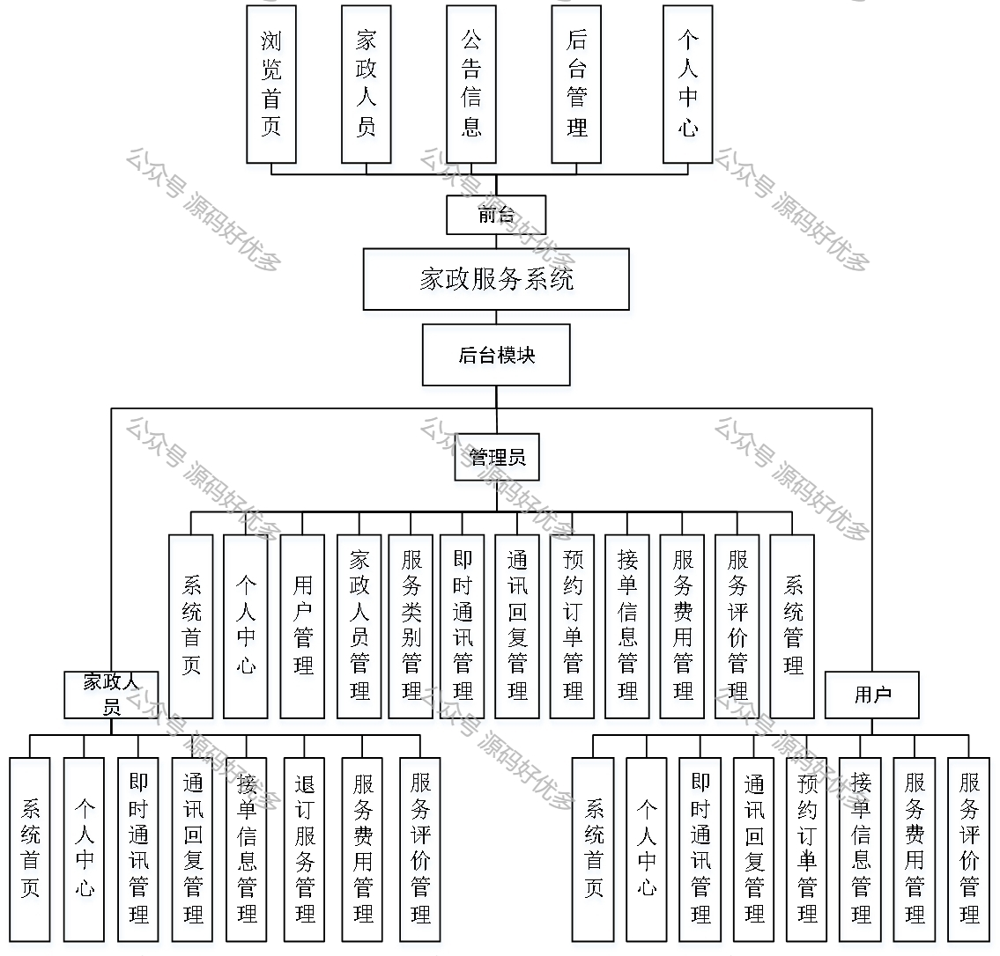
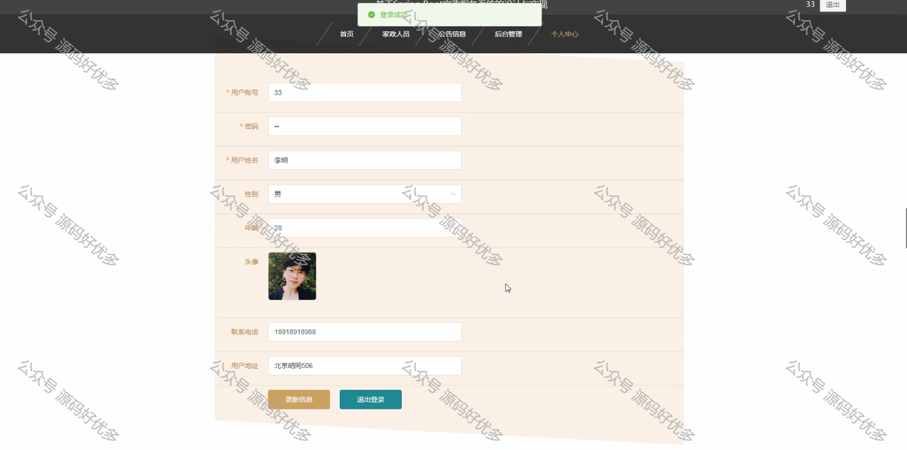
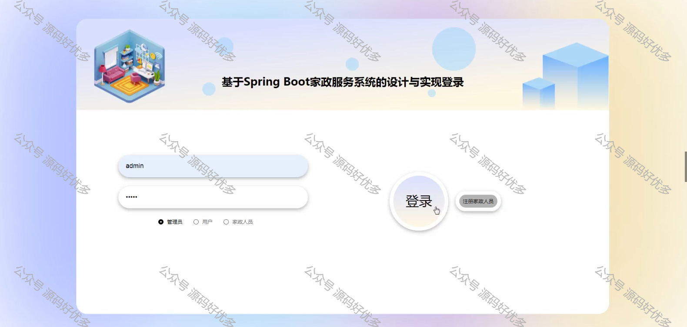
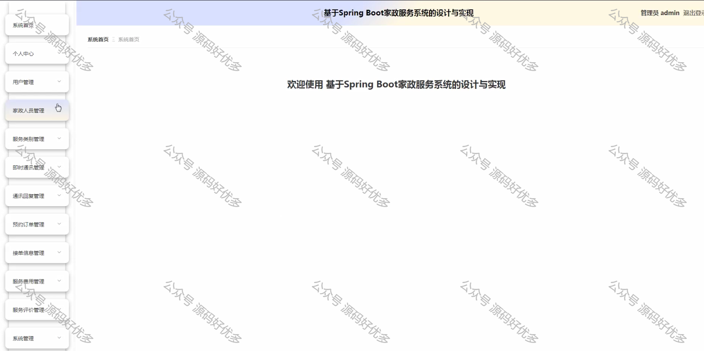
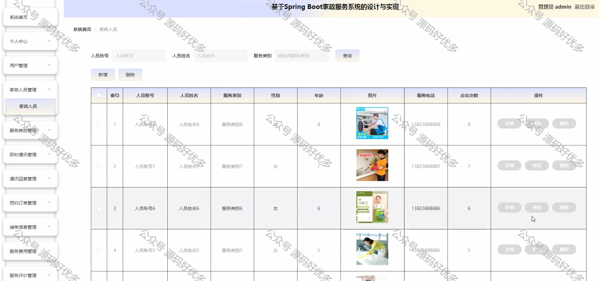
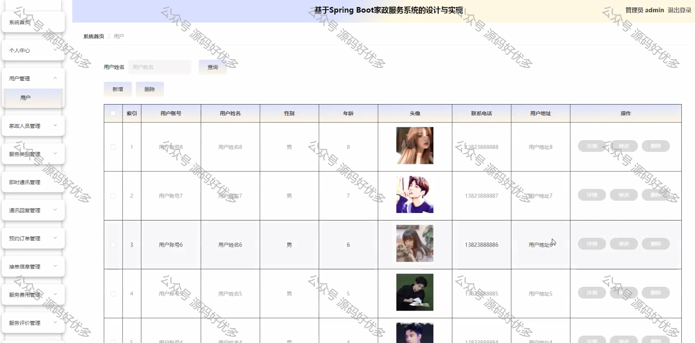
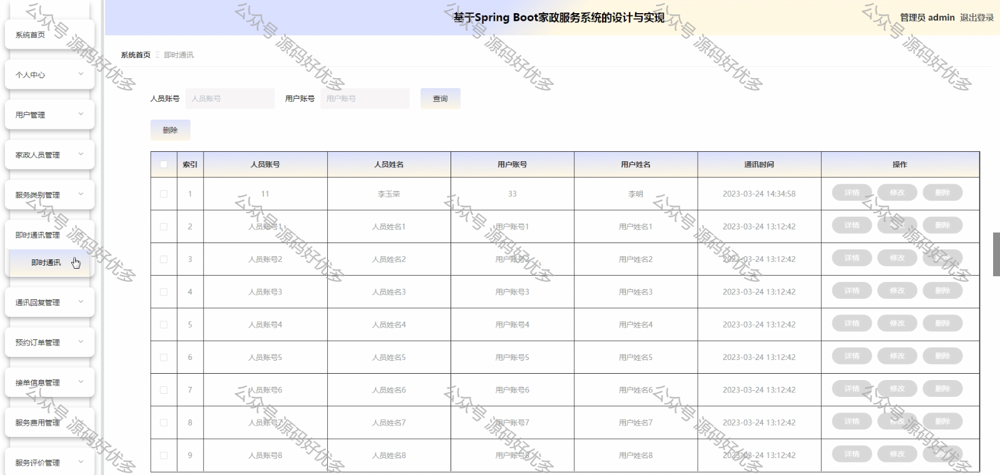
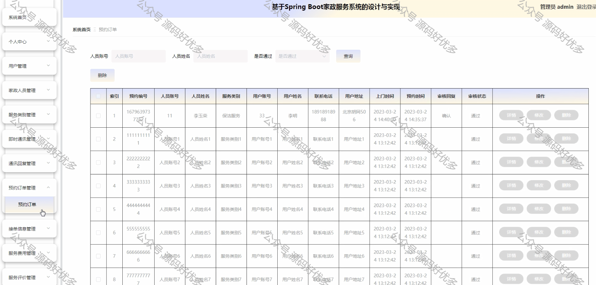
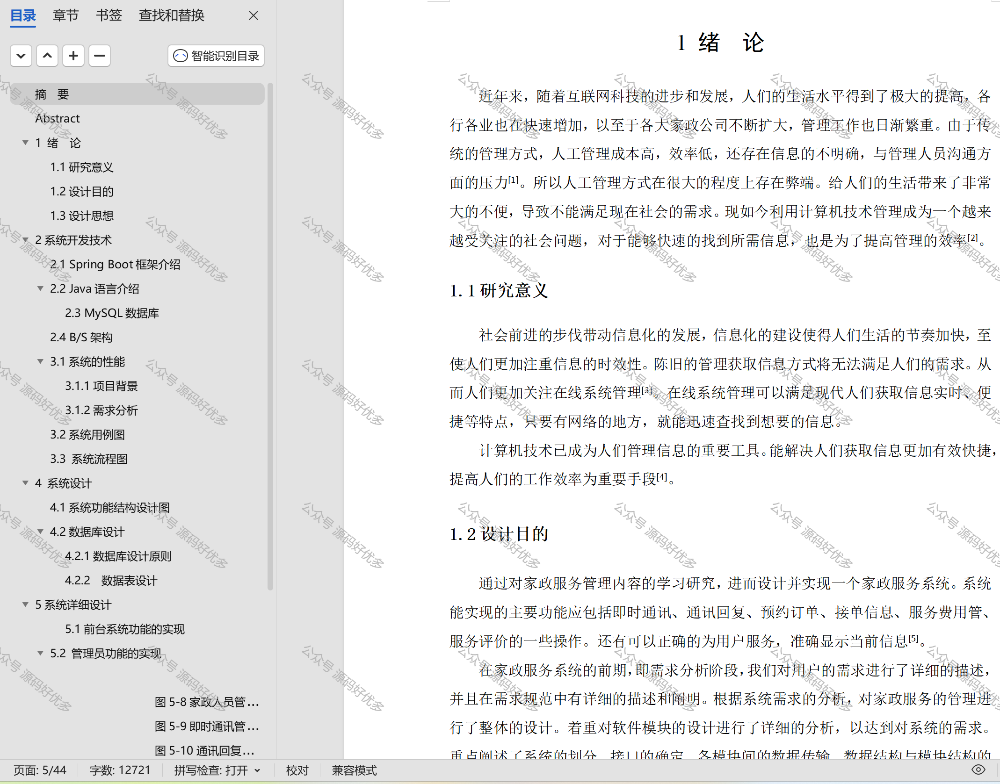

 
## 查看主页获取源码

### 一、作品包含

源码+数据库+设计文档万字+PPT+全套环境和工具资源+部署教程

### 二、项目技术

前端技术：Html、Css、Js、Vue、Element-ui

数据库：MySQL

后端技术：Java、Spring Boot、MyBatis

  

### 三、运行环境

开发工具：IDEA/eclipse

数据库：MySQL5.7

数据库管理工具：Navicat10以上版本

环境配置软件： JDK1.8+Maven3.6.3

前端Nodejs：14

### 四、项目介绍

项目编号：springbootA340

家政服务管理系统通过集成信息处理和资源调度，有效提升家政服务的管理效率和服务质量。

这个系统主要包括三个角色：管理员、家政人员和用户。他们的主要功能如下：

管理员：系统首页、用户管理、家政人员管理、服务类别管理、即时通讯管理、通讯回复管理、预约订单管理、接单信息管理、服务费用管理、服务评价管理、系统管理；

家政人员：个人中心、即时通讯管理、通讯回复管理、接单信息管理、服务费用管理、服务评价管理；

用户：系统首页、个人中心、即时通讯管理、通讯回复管理、预约订单管理、接单信息管理、服务费用管理、服务评价管理。

### 五、运行截图

  
